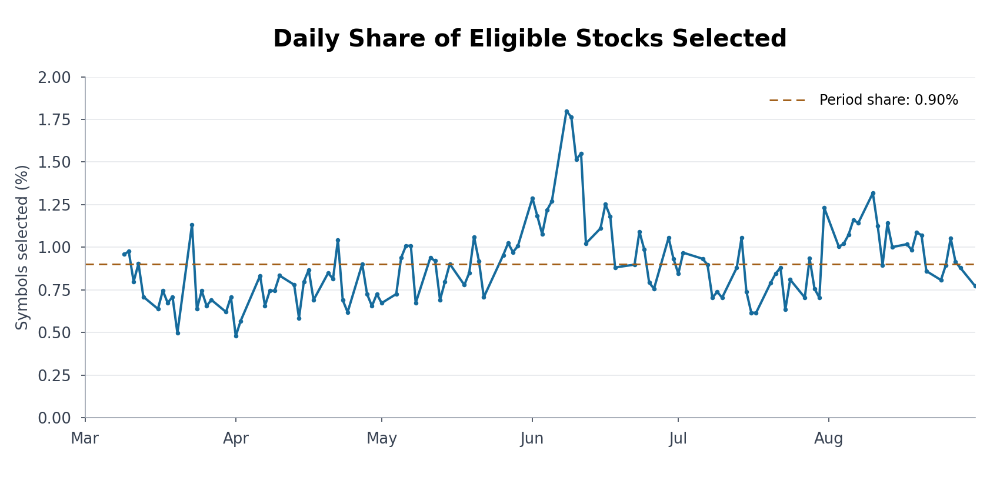
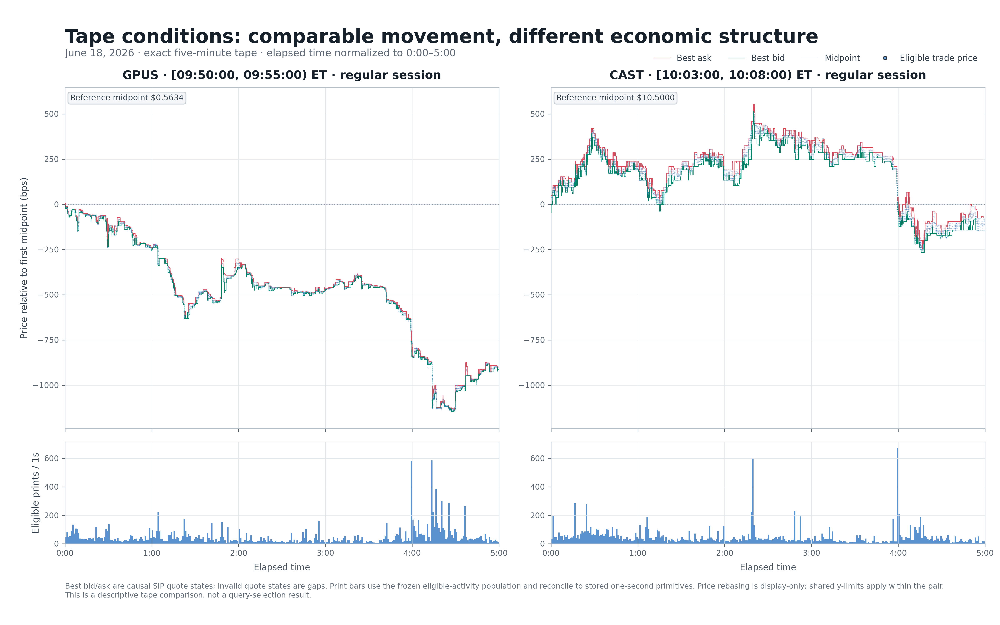
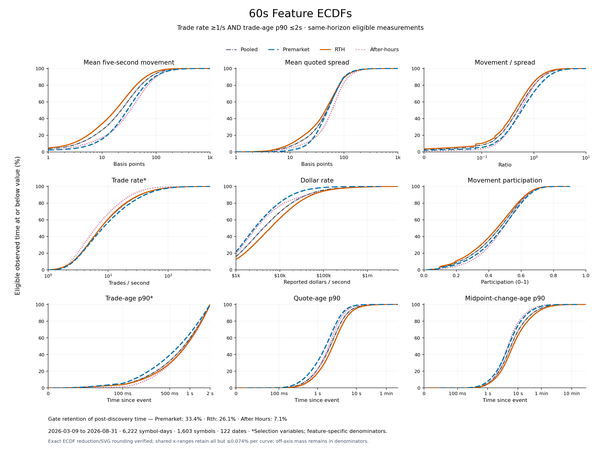
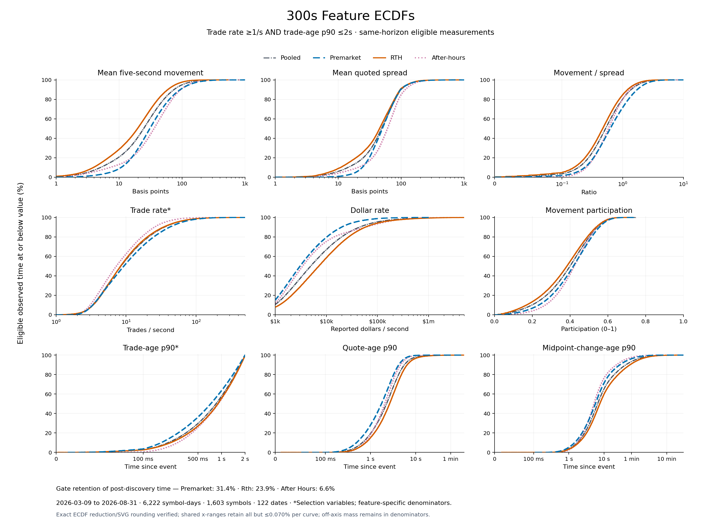
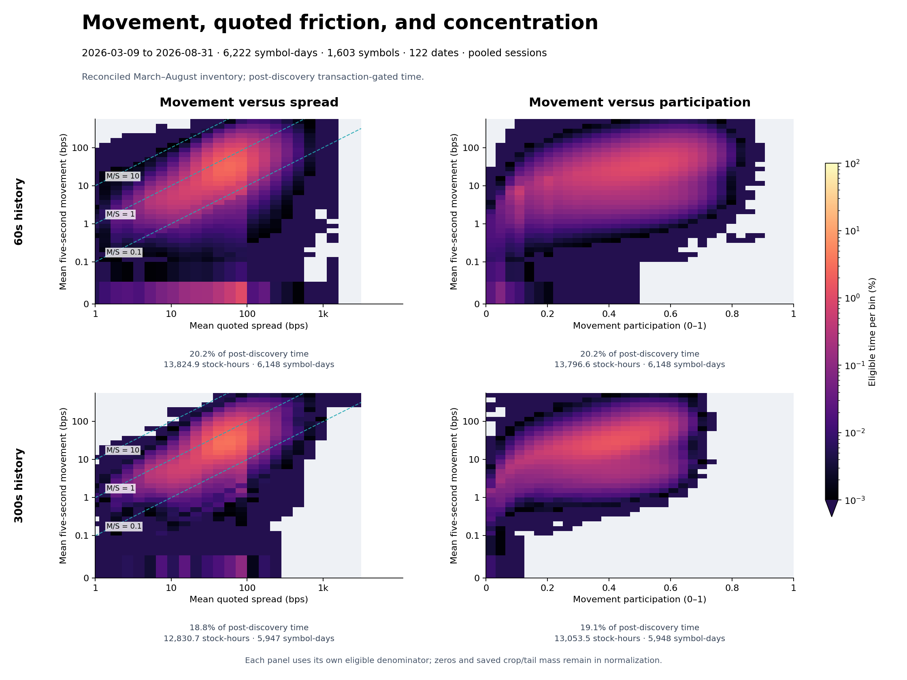
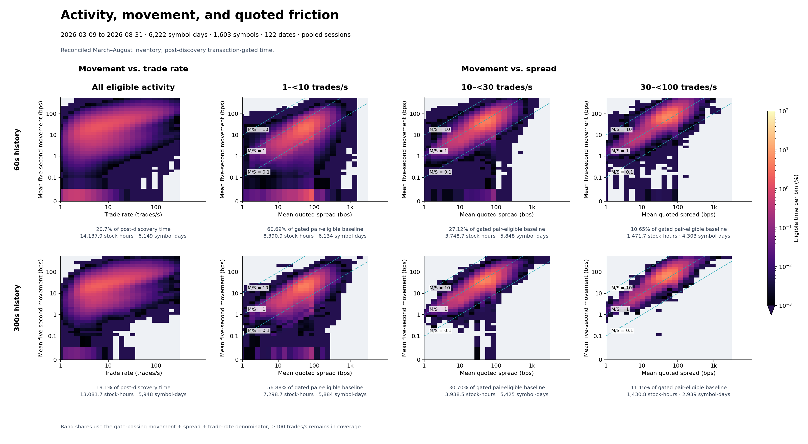
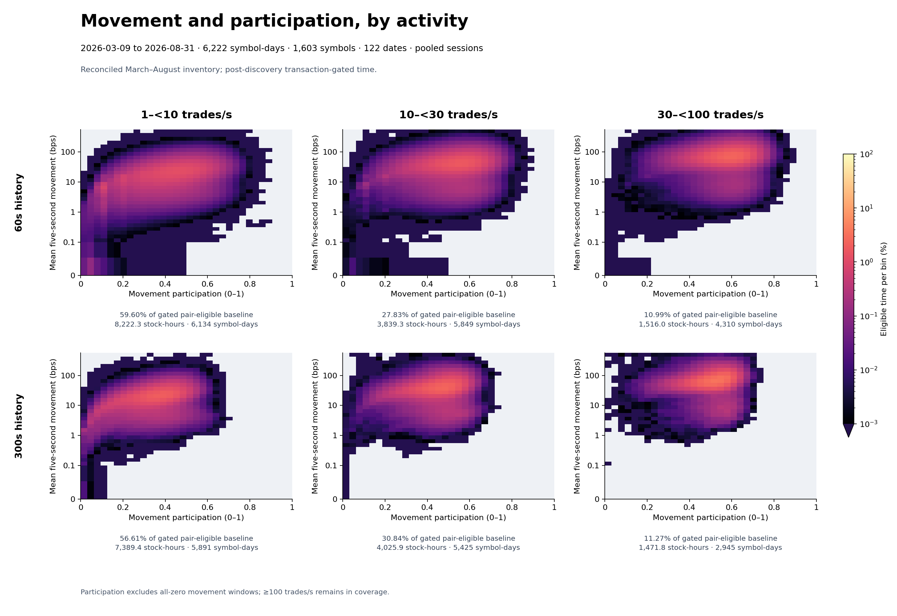

# Intraday Equity Tape Features

## 1. Introduction

This historical dataset converts U.S. equity trades and national best bid and offer (NBBO) quotes into continuous measurements of intraday trading conditions. This report describes the feature dataset and its use for historical analysis. Researchers can define selections using movement magnitude, quoted spread, trading activity, movement concentration, and trade/quote event freshness.

A volatility and activity screen identifies stocks worth examining, but the conditions that trigger selection need not persist throughout the day. A selected stock may alternate between frequent and intermittent trades, narrow and wide spreads, or substantial and limited price movement. Describing those conditions at individual points in time supports more specific research requirements than symbol-date selection alone.

The product provides one-second observations with trailing 60-second and 300-second features. This report describes the selected universe, defines the measurements, and examines their distributions and relationships. The features describe observed conditions; researchers determine which combinations are relevant to their work.

## 2. Dataset and Universe Coverage

### 2.1 Acquisition universe

Acquiring, storing, and processing every trade and quote for the full equity universe on every trading day over six months would exceed this project’s resource budget. The acquisition screen creates a smaller research dataset focused on stocks that have exhibited at least one period of substantial intraday price range and trading activity. These are conditions of particular interest for studying short-term directional trading, even though the features themselves measure conditions without assigning a direction or predicting returns.

The acquisition universe is selected from Massive.com’s daily active common-stock and common-stock American depositary receipt (ADR) universe. A screen evaluates two consecutive minutes within 04:00–20:00 Eastern Time and requires all of the following:

- A combined two-minute high–low log range of at least 700 basis points: 10,000 × log(maximum high / minimum low).
- At least 1,600 reported trades across the two minutes.
- At least 100 reported trades in each minute.

The screen has no dollar-volume requirement. It determines which symbol-date pairs receive detailed trade-and-quote acquisition. Selection establishes that a qualifying period occurred; it does not imply that comparable movement or activity persists afterward. For each selected symbol-date pair, post-discovery time runs from the endpoint of the first qualifying two-minute screening window through 20:00 ET, including subsequent quiet periods.

*Figure 1. Daily share of the reference universe selected for detailed trade-and-quote acquisition. The dashed line shows the overall selection rate of 0.90% across the study period.*

Each symbol counts once per date. Reference-universe members remain in the denominator even if no usable minute bars were observed. The overall selection rate is the ratio of summed selected and eligible counts across the period.

The screen selected **0.90% of eligible symbol-date combinations**, with daily shares ranging from **0.48% to 1.80%**. Across the period, **1,603 of 6,023 distinct ticker symbols (26.6%)** were selected at least once. This substantially reduces the acquisition and processing scope while retaining a broad set of names over time. The resulting dataset supports research within this deliberately selected population; it is not a representative sample of all equity trading conditions.

### 2.2 Dataset coverage

| Coverage item | Value |
|---|---:|
| Observed dates | March 9–August 31, 2026 |
| Trading dates | 122 |
| Eligible reference-universe symbol-date pairs | 691,464 |
| Selected symbol-date pairs | 6,222 |
| Completed feature symbol-date pairs | 6,222 |
| Distinct selected symbols | 1,603 |
| Represented post-discovery stock-hours | 68,375.08 |

*Coverage begins March 9; March 2–6 is not included.*

A stock-hour is one hour of observations for one stock; simultaneous observations in different stocks add to this total. Features have been calculated for every selected symbol-date pair, but individual measurements can be unavailable when valid data or sufficient history is missing.

### 2.3 Observation timing and eligibility

Each observation summarizes the second [t−1s, t) and is available at its endpoint t on the Securities Information Processor (SIP) timestamp clock. An event stamped exactly t belongs to the next second. Trailing histories continue across the premarket, regular trading hours (RTH), and after-hours boundaries.

Analysis begins after the acquisition screen first qualifies a stock. A measurement is included only when its required data are valid and enough recent history is available. Histories do not bridge declared data breaks, and observations during halts or before the required history has rebuilt are excluded. A validly observed second with no eligible trades counts as zero activity; unavailable or undefined measurements are marked separately, with a reason.

## 3. Feature Definitions

### 3.1 Measurements and horizons

Nine features are provided at both 60s and 300s horizons, producing eighteen numerical fields. The horizons describe recent conditions at different historical scales using the same definitions. They are not eighteen independent dimensions. The five-second lag defines the movement being measured; the 60s and 300s histories define the periods over which those measurements are summarized.

| Feature | Measurement | Interpretation |
|---|---|---|
| Mean five-second movement | Mean absolute five-second midpoint log change, in bps | Magnitude of short-scale movement |
| Movement participation | Squared sum of movement magnitudes divided by their count times their sum of squares | How broadly movement magnitude is distributed across measured changes |
| Mean quoted spread | Full NBBO spread in bps, weighted by valid quote duration | Typical bid–ask separation |
| Mean movement / spread | Mean movement divided by same-history mean quoted spread | Movement magnitude relative to quoted spread |
| Trade rate | Eligible reported trades per supported second | Trade intensity |
| Dollar rate | Eligible reported dollar turnover per supported second | Reported turnover |
| Trade-age p90 | 90th percentile of supported endpoint ages since the last eligible trade | Recent trade freshness |
| Quote-age p90 | 90th percentile of supported endpoint ages since the latest quote event | Recent quote freshness |
| Midpoint-change-age p90 | 90th percentile of supported exact ages since an observed valid midpoint change | Recent midpoint updating |

Movement is calculated from duration-weighted one-second midpoints. Five-second changes are sampled every second, so they overlap. A 300s mean movement value is an average of five-second movement magnitudes within that history, not a five-minute return.

For supported nonnegative movement magnitudes d₁,…,dₙ, mean movement is M = Σdᵢ/n and participation is P = (Σdᵢ)²/(nΣdᵢ²). Equal positive magnitudes give P = 1; concentration in a smaller number of changes lowers P. Participation ignores direction and ordering. Large and small movements can have the same participation, and a reversal can have high participation. All-zero movement leaves M = 0 and P undefined.

Let S denote mean quoted spread over the same history. The movement/spread ratio, M/S, compares these two summaries. It is useful for describing economic context, but does not measure a contemporaneously executable price move. Age p90s summarize time-sampled ages, not event-to-event gaps. A quote refresh can reset quote age without changing the midpoint.

### 3.2 Illustrative tape comparison

The following intervals have similar trade frequency and mean movement readings, but substantially different quoted spreads. This illustrates why the dataset retains separate measurements rather than assigning a single activity label.

*Figure 2. GPUS [09:50,09:55) ET and CAST [10:03,10:08) ET on June 18, 2026. Bid, ask, midpoint, trade prices, and trade counts show how similar activity and movement can occur with different quoted spreads. Both intervals share a five-minute elapsed-time axis; prices are rebased for comparison. Examples were selected retrospectively for illustration.*

| Measurement | GPUS | CAST |
|---|---:|---:|
| Eligible reported trades per second over the displayed interval | 50.1 | 49.1 |
| Average trailing 300s movement, bps | 45.21 | 45.11 |
| Average trailing 300s quoted spread, bps | 18.72 | 67.11 |
| Average trailing 300s movement/spread ratio | 2.42 | 0.67 |

*Movement and spread values average the trailing five-minute features over each example, so they also reflect activity before the displayed interval.*

The similar movement and trade readings conceal a spread difference of approximately 3.6 times. This is a concrete distinction the feature set can express. The visible paths provide context, but neither their shape nor these summary measurements establishes future returns or execution outcomes.

## 4. Feature Distributions

The starting population is the **68,375.08 post-discovery stock-hours across the 6,222 selected symbol-date pairs in Section 2**. Minute bars determine which stocks and dates enter the dataset; the distributions here use the one-second features calculated from their acquired trades and quotes. This population includes all represented time after each stock first qualifies through 20:00 ET, including quiet periods.

Within that population, an **activity filter** selects one-second observations where both the trailing trade rate is ≥1 trade/s and the trailing trade-age p90 is ≤2s, with valid measurements for both. The filter is applied separately to the existing 60s and 300s features. It selects observations for analysis without changing the underlying dataset or recalculating feature histories. These requirements identify relatively frequent and recent trading over the history; they do not guarantee uninterrupted trades or a current trade age below two seconds.

The table reports the fraction of the starting population that passes this activity filter: **20.7% at 60s and 19.1% at 300s**. These are shares of post-discovery observation time within the already selected dataset, not shares of the full equity universe or of the minute bars used for screening. No additional threshold is applied to movement, spread, participation, dollar rate, or quote freshness.

| Session | Post-discovery time passing 60s activity filter | Post-discovery time passing 300s activity filter |
|---|---:|---:|
| Premarket | 33.4% | 31.4% |
| Regular hours | 26.1% | 23.9% |
| After-hours | 7.1% | 6.6% |
| **All sessions** | 20.7% | 19.1% |

For each session, retained time equals seconds passing the activity filter divided by all post-discovery seconds in that session. Seconds with unavailable filter inputs remain in this denominator but cannot pass. Across all sessions, the filter retains approximately **14,148 stock-hours at 60s** and **13,086 stock-hours at 300s**. Individual plots then require valid measurements for the features shown, so their coverage can be slightly smaller.

An empirical cumulative distribution function (ECDF) gives the fraction of eligible selected observations at or below each value. Each stock-second has equal weight. Curves distinguish premarket [04:00,09:30), regular hours [09:30,16:00), after-hours [16:00,20:00), and their pooled population, assigning each second to the session in which it begins. At a given percentile, a curve farther to the right indicates a larger feature value; at a given feature value, a higher curve indicates a larger fraction of observations at or below that value.

*Figure 3. Feature distributions within the active trading population, using trailing 60-second histories. Curves distinguish trading sessions and their pooled population; a curve farther right at a given percentile indicates a larger feature value.*

*Figure 4. Feature distributions within the active trading population, using trailing 300-second histories. Curves distinguish trading sessions and their pooled population; a curve farther right at a given percentile indicates a larger feature value.*

Within the active trading population, premarket observations generally exhibit greater five-second movement, higher trade rates, and higher movement-to-spread ratios than regular-hours observations. Trade and quote ages are also generally shorter, with similar patterns across the 60s and 300s histories. These differences do not extend to every dimension: regular hours exhibit higher dollar turnover, while premarket spreads are not consistently narrower. The distributions describe differences within the selected population; stock and date composition may contribute to the session contrasts.

The trade-rate and trade-age cutoffs visible in these distributions follow from the selection criteria. Differences between the 60s and 300s curves reflect both history length and which observations qualify at each horizon.

## 5. Joint Feature Distributions

Joint views describe combinations that separate distributions cannot resolve. These figures use the active trading requirements in Section 4, with additional eligibility for the displayed features.

Each heatmap groups eligible one-second observations into bins defined by the two plotted features. Cell color shows the percentage of that panel’s eligible observations falling within each bin. Brighter cells represent more frequently observed combinations; the logarithmic color scale also makes less common combinations visible. Each panel is normalized separately, so equal colors indicate equal percentages within their respective populations, not equal amounts of total time. Observations outside the displayed axes remain in the denominator.

In movement–spread panels, dashed lines mark constant movement/spread ratios; observations above the M/S = 1 line have mean five-second movement greater than mean quoted spread.

These distributions measure time spent in observed conditions. Adjacent observations share overlapping feature histories and are not independent samples; sustained conditions therefore contribute repeatedly. Stocks and dates also contribute unequally, so pooled patterns may reflect differences in population composition.

### 5.1 Movement, spread, and participation

*Figure 5. Movement versus quoted spread (left) and movement participation (right), with 60-second histories above and 300-second histories below. Brighter cells show combinations accounting for a larger share of time within each panel, on a logarithmic color scale. Dashed lines mark constant movement/spread ratios; above M/S = 1, mean five-second movement exceeds mean quoted spread.*

Mean five-second movement is smaller than mean quoted spread for most eligible observations: approximately 20.3% of eligible time has M/S >1 at the 60s horizon, compared with 19.6% at 300s. Movement and participation show an upward association, but a broad range of movement magnitudes occurs at similar participation values. The 300s distributions appear more compact, although their different eligible populations prevent attributing this solely to history length.

### 5.2 Trading activity and spread

*Figure 6. Movement versus trade rate (left), followed by movement versus spread in increasing trade-rate bands. The top row uses 60-second histories; the bottom row uses 300-second histories. Brighter cells indicate a larger share of time within that panel, on a logarithmic color scale. Dashed lines mark constant movement/spread ratios, helping compare movement relative to spread across activity bands.*

Within higher trade-rate bands, movement and quoted spread form a more pronounced diagonal concentration, approximately parallel to constant M/S reference lines. This indicates that larger movement magnitudes coexist with proportionally wider spreads along the main concentration. Higher trading activity therefore does not by itself establish a high movement-to-spread ratio.

### 5.3 Trading activity and participation

*Figure 7. Movement versus participation across increasing trade-rate bands, with 60-second histories above and 300-second histories below. Brighter cells indicate a larger share of time within each band, on a logarithmic color scale. Moving upward means larger average movement; moving right means movement magnitude is distributed more evenly across the measured changes.*

Higher activity bands concentrate more strongly at larger movement magnitudes, while their participation ranges overlap substantially. Within each band, similar participation values coexist with different movement levels. Participation therefore describes a separate aspect of the observed movement distribution, without identifying distinct tape classes or directional path behavior.

The displayed activity bands cover 1–<10, 10–<30, and 30–<100 trades/s. Observations at 100 trades/s or higher are included in the overall analysis but are not shown as a separate band. The [technical supplement](reports/technical-supplement.md#figure-sources-and-verification) provides detailed plotting and coverage notes.

## 6. Research Use

The feature dataset supports researcher-defined selections of historical observations. The 60-second measurements describe recent conditions, while the 300-second measurements provide slower historical context. Persistence of a rolling measurement does not by itself establish persistence of equally strong local conditions.

An exploratory query based on trailing 300-second thresholds returned intervals whose membership could continue after shorter-history conditions weakened. These results do not establish retrieval of sustained local conditions and are excluded from the report’s results. The report evaluates observation-level measurements and their descriptive distributions; it does not validate an interval-selection rule.

## 7. Data Use and Limitations

Each observation includes its symbol, date, time, feature values, data-quality information, and source references. The dataset also includes the underlying one-second measurements, allowing researchers to recalculate the defined rolling features. Studying subsecond price paths or changing which trades and quotes qualify may require the original event data.

Features use SIP timestamps to determine what information is available at each observation time. Applying the same analysis live also requires accounting for when screening results and halt information are actually received. This historical dataset does not establish live delivery latency.

The report covers stocks selected for volatility and activity, observed after they first qualify. Stocks and dates with more qualifying time contribute more to the pooled distributions, so broad symbol coverage does not ensure broad support for every pattern. Session differences may reflect which stocks are trading. Isolating the effect of the 60s versus 300s history requires comparing the same observation times with valid measurements at both horizons.

NBBO quotes describe consolidated top-of-book prices and displayed size. They do not reveal full depth, queue position, hidden liquidity, or executable capacity. Quoted spread is not realized execution cost, dollar turnover is not available liquidity, and movement participation does not identify trend direction or ordering.

The report establishes the dataset’s coverage, measurement definitions, and descriptive structure. It does not establish that selected conditions persist into the future, forecast direction, or produce positive trading expectancy. Those claims require separate evaluation with explicit timing, execution, and cost assumptions.

**Technical documentation and supporting data.** The [feature contract](docs/tape_data_product/README.md) provides exact definitions and calculation rules. The [technical supplement](reports/technical-supplement.md) contains observation-status counts, plotting notes, and links to the supporting data and verification records. For installation, synthetic examples, and implementation details, see the [developer guide](docs/developer-guide.md). The [dataset build guide](docs/dataset-build.md) identifies the included calculation steps and the acquisition and report-generation stages still needed for complete reproduction.
