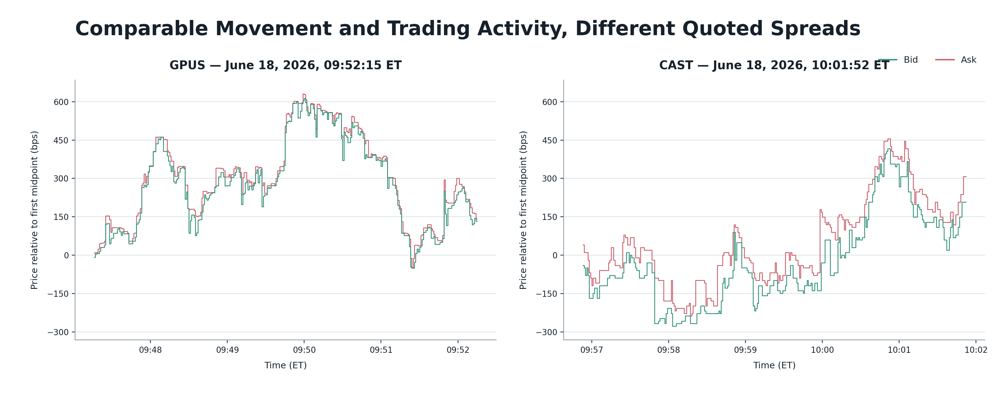
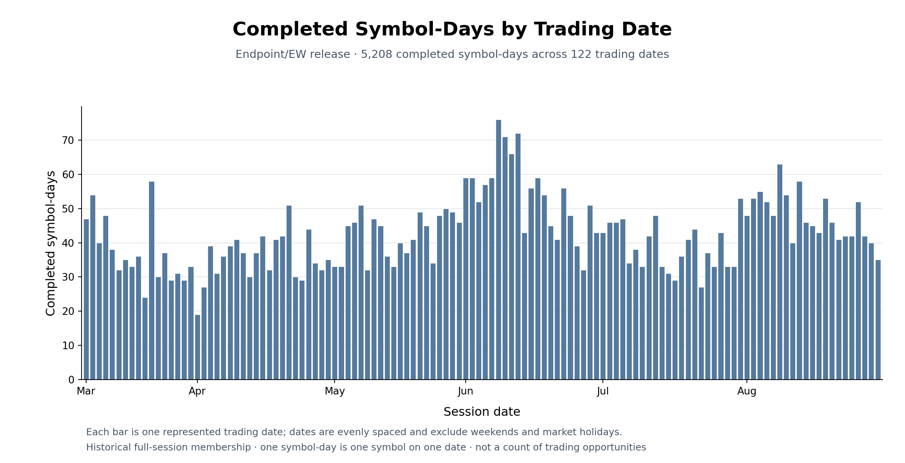
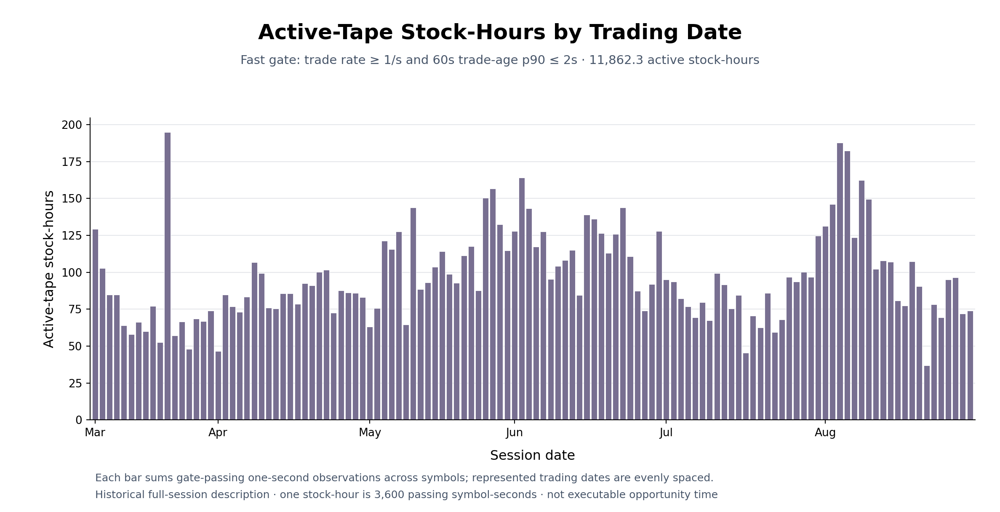
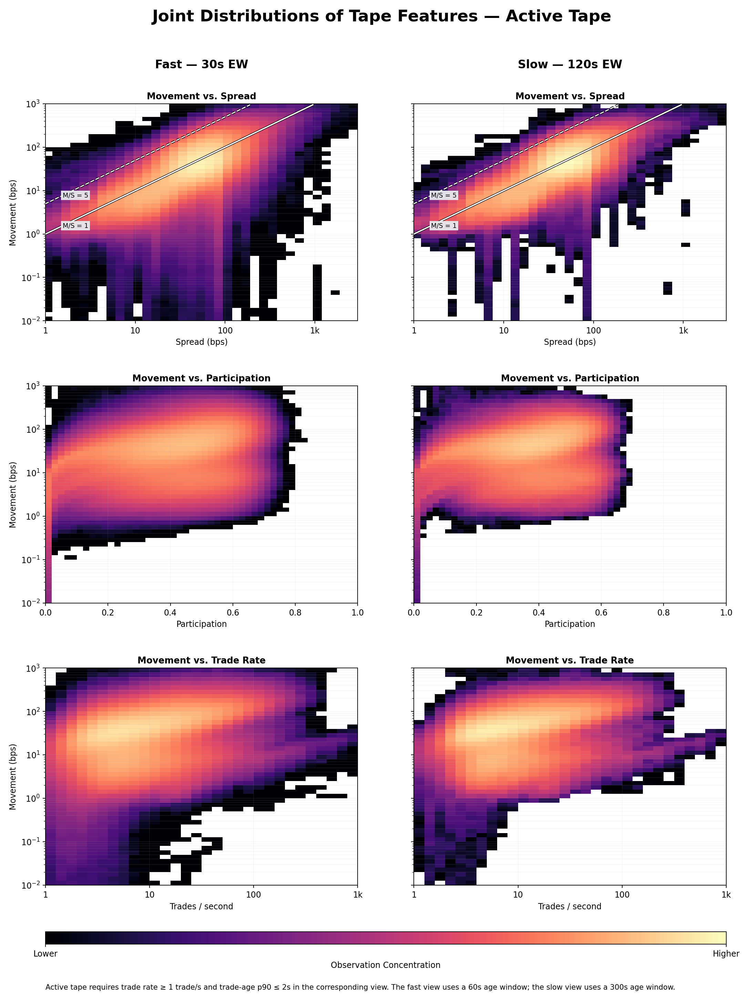
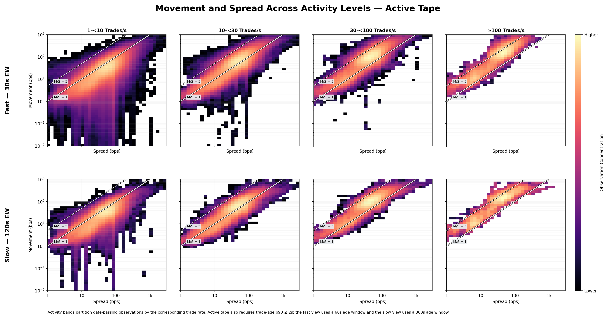
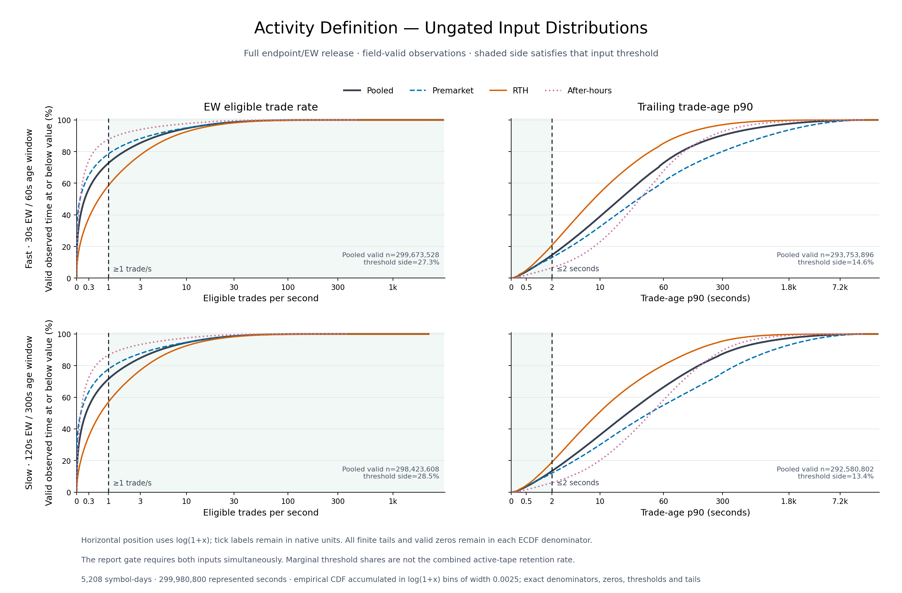
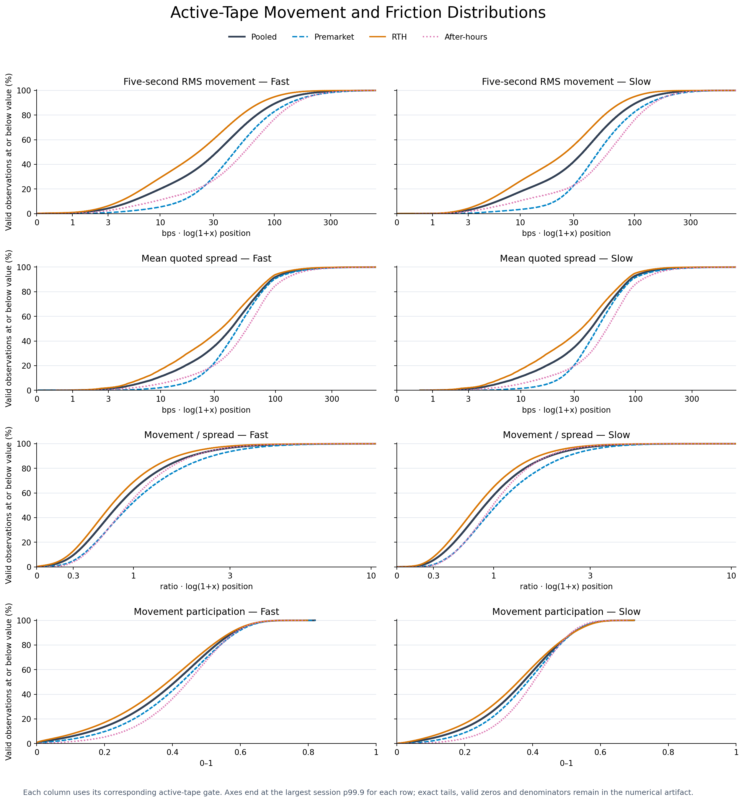
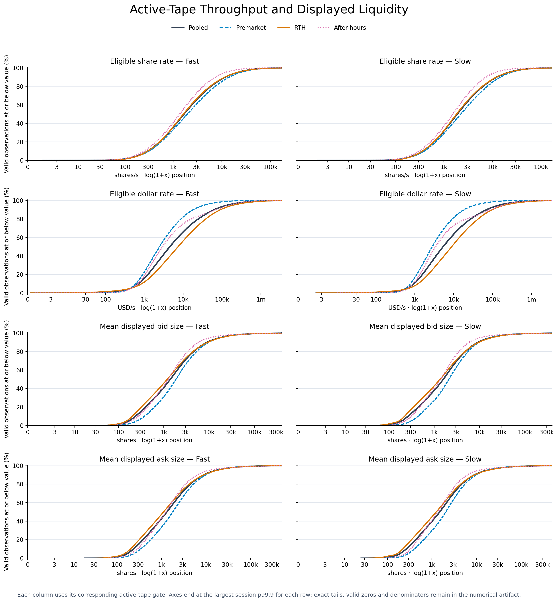
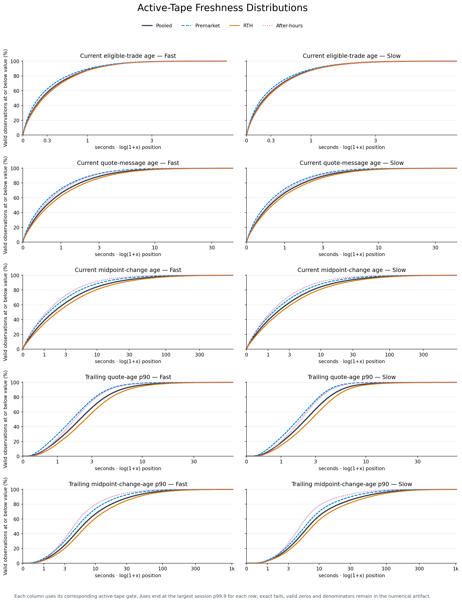

# U.S. Equities Microstructure Data Product

## Overview

A Python/DuckDB research data product that transforms Massive U.S. equities trades and quotes into one-second measurements of market conditions. Researchers can specify the movement, quoted friction, activity, liquidity, and freshness they require, then retrieve matching historical observations and sustained periods for further study.

- **Scope:** The historical population is retrospectively screened for eventful symbol-days. The product supports reproducible measurement and selection—not claims of predictive validity, executable returns, or market-wide representativeness.
- **Scale:** Approximately 300 million one-second rows across 5,208 symbol-days and 122 trading dates, March–August 2026.
- **Measurements:** 27 queryable fields across 12 research dimensions, including midpoint movement, movement concentration, quoted spread, movement/spread ratios, transaction throughput, displayed liquidity, and freshness.
- **Methodology:** Explicit SIP-time alignment, trade-eligibility rules, exposure-weighted aggregation, and coverage requirements. Feed gaps, invalid observations, and trading halts are handled separately from genuine market inactivity.
- **Research workflow:** Query stored features with SQL through Python or the command line, optionally group matching endpoints into sustained periods, and export results to Parquet.
- **Worked example:** A full-release comparison applies an eight-condition screen—including a $10,000/s dollar-throughput minimum—to the same available timestamps in both published views. It identifies 577 fast-view and 854 slow-view periods and quantifies how the choice of view changes the selected stocks and time intervals.

## 1. Purpose

Short-horizon signals are not equally meaningful under every market condition. A quantitative researcher may want to study a signal only when a stock has substantial recent movement, when that movement is large relative to the quoted spread, when transactions or traded dollars arrive at a sufficient rate, or when trades and quotes are recent. The database measures these characteristics once per second so that they can define an explicit research universe rather than remain informal judgments about whether a stock was “active.”

This distinction matters because selecting a symbol-day after one sharp move says little about the conditions present during the rest of its session. The database lets a researcher specify the conditions of interest and retrieve the matching observations, time ranges, and symbol-days for inspection, export, or downstream signal research. Different measurements can be combined to separate superficially similar episodes—for example, comparable price movement occurring with very different quoted friction or transaction activity.

The product is therefore a tool for reproducible historical selection and investigation, including research into directional strategies. Its measurements describe the tape observed at each timestamp; they do not by themselves establish that a condition will persist, predict subsequent returns, produce executable fills, or earn a profit after costs.

Similar movement, different spreads. At the selected timestamps, GPUS and CAST have similar measured price movement and trading activity, but CAST has a substantially wider bid–ask spread. The database lets researchers distinguish these conditions rather than treating both stocks as simply “active.” Section 3.3 compares the measurements in detail.



## 2. Research Population and Timing

To create a manageable historical population for detailed trade-and-quote processing, this report first screens inexpensive minute aggregates. A **symbol-day** means one stock on one trading date. It enters the population when two consecutive minutes contain a combined high–low log-price range of at least 700 basis points, at least 1,600 reported trades in total, and at least 100 reported trades in each minute. These thresholds deliberately favor eventful symbol-days while controlling acquisition, storage, and processing costs. They are not optimized trading rules, and they do not prove that every qualifying move was liquid, error-free, or representative of the broader equity market.

The accepted release contains 5,208 symbol-days across 122 trading dates from March 9 through August 31, 2026. Daily membership ranges from 19 to 76 symbol-days and averages 42.69. Figure 1 shows how that completed research population is distributed across the represented dates.

*Figure 1. Completed symbol-days by represented trading date. Each bar counts the stocks with stored full-session observations on that date.*

Population membership is retrospective. Once a symbol-day qualifies, the release contains its stored full-session observations, including observations from before the qualifying two-minute episode. The report therefore describes conditions across historically selected sessions; it does not reconstruct which stocks a live screener would have made available at each moment. The same feature definitions could be applied to a broader population, but doing so would require acquiring and processing that population and validating the larger operational scale.

## 3. Features

The database's 27 queryable fields support **12 researcher-facing dimensions**. Nine measurements have fast and slow exponentially weighted views, producing 18 fields. Trade, quote, and midpoint-change freshness each provide a current age plus 60-second and 300-second age-p90 readings, producing the other nine fields. The displayed-liquidity fields are stored in shares; the table presents their query-time dollar-notional derivations because those are more comparable across stocks.

### 3.1 Measurements and views

| Feature | Measurement | Unit | Published views | Interpretation |
|---|---|---|---|---|
| Movement | RMS of five-second endpoint-midpoint returns | bps | Fast, slow | Scale of recent price movement |
| Participation | Concentration of the return magnitudes used in movement | 0–1 | Fast, slow | Whether movement is broadly distributed or dominated by fewer returns |
| Quoted spread | Duration-weighted full bid–ask spread | bps | Fast, slow | Recent quoted friction |
| Movement/spread | Movement divided by the corresponding quoted spread | ratio | Fast, slow | Movement scale relative to quoted friction |
| Trade rate | Eligible reported trades per supported second | trades/s | Fast, slow | Transaction frequency |
| Share rate | Eligible traded shares per supported second | shares/s | Fast, slow | Share throughput |
| Dollar rate | Eligible traded dollars per supported second | USD/s | Fast, slow | Dollar throughput |
| Displayed bid notional | Mean shares displayed at the best bid, valued at the current bid | USD | Fast, slow | Recent displayed bid-side liquidity on a dollar scale |
| Displayed ask notional | Mean shares displayed at the best ask, valued at the current ask | USD | Fast, slow | Recent displayed ask-side liquidity on a dollar scale |
| Trade freshness | Current trade age and trailing trade-age p90 | seconds | Current, 60s, 300s | Whether an eligible trade occurred recently now and consistently through recent history |
| Quote freshness | Current quote age and trailing quote-age p90 | seconds | Current, 60s, 300s | Whether quote messages were recent now and consistently through recent history |
| Midpoint freshness | Current midpoint-change age and trailing midpoint-change-age p90 | seconds | Current, 60s, 300s | Whether the prevailing midpoint changed recently now and consistently through recent history |

**Movement.** Movement is the exponentially weighted root-mean-square magnitude of five-second endpoint-midpoint returns, recalculated every second. It measures the scale of recent price changes, not their direction.

**Participation.** Participation is high when return magnitudes are broadly distributed through the weighted history and low when movement is dominated by fewer large returns. It discards return signs and does not identify trend quality or path shape. Recency still matters: moving a large return to a different timestamp changes its exponential weight and can change participation.

**Quoted spread.** Quoted spread is the recent duration-weighted full separation between the best bid and ask, expressed in basis points. It measures displayed quoted friction rather than realized execution cost.

**Movement/spread.** Movement/spread compares the measured movement scale with the corresponding quoted spread. It is useful for separating similar movement occurring under different quoted friction, but it is not a capturable-return or expectancy estimate.

**Trade rate.** Trade rate measures the frequency of eligible reported transactions. A reliably observed second with no eligible trades contributes a valid zero; missing observation time does not.

**Share rate.** Share rate measures eligible share volume per second. It distinguishes transaction frequency from the quantity of stock changing hands.

**Dollar rate.** Dollar rate measures eligible traded value per second. It provides a price-sensitive throughput measure that can differ materially from share rate.

**Displayed bid notional.** The stored fast and slow measurements are mean shares displayed at the best bid. For research queries, the report expresses them on a dollar scale by multiplying the mean shares by the current bid price. This is current-price-valued mean displayed size, not an EW average of historical price multiplied by size.

**Displayed ask notional.** The ask-side reading applies the same derivation using the current ask price. Bid and ask remain separate so that side-specific displayed liquidity is not concealed by an aggregate. Neither side includes deeper quotes, hidden liquidity, queue position, or executable capacity.

**Trade freshness.** Current trade age answers whether an eligible trade occurred recently at this endpoint. Trade-age p90 answers whether trades remained consistently recent over the preceding 60 or 300 seconds. A single new trade after a quiet interval can satisfy a current-age threshold while leaving the historical p90 elevated.

**Quote freshness.** Current quote age measures time since the latest accepted quote message, while quote-age p90 describes upper-tail quote staleness over the preceding window. Quote messages reset the underlying age series without necessarily changing the midpoint, so these readings measure message freshness rather than price movement.

**Midpoint freshness.** Current midpoint-change age measures time since the latest observed valid change in the prevailing midpoint. Midpoint-change-age p90 measures whether those changes remained consistently recent over 60 or 300 seconds. Together they distinguish frequently refreshed quotes from tape in which the prevailing price actually updates.

### 3.2 Views, timing, and availability

The nine movement, friction, activity, and displayed-liquidity measurements are published in a **fast** view with a 30-second exponential half-life and a **slow** view with a 120-second half-life. A half-life is a decay setting—the weight of an observation halves after that interval—not a hard lookback window. Freshness p90s instead use ordinary fixed trailing windows of 60 and 300 seconds, while current ages are unsmoothed. Displayed bid and ask notionals are query-time derivations from the corresponding EW mean shares and current side price; they are not additional stored features.

Each timestamp labels measurements constructed from preceding events; a row ending at time $t$ summarizes the second immediately before $t$. Missing, invalid, or insufficiently covered inputs remain unavailable rather than being converted to observed inactivity. Recognized halts suppress publication and reset the affected histories. After trading resumes, the fast and slow views require 60 and 300 seconds of new startup history, respectively, before they can become available again.

The five-second lag fixes the movement scale; the two half-lives provide different recency settings at that same scale. These are product defaults, not empirically optimal parameters. Endpoint midpoints avoid directly measuring bid–ask bounce between transaction prices, but they still contain quote noise and do not estimate a noise-free efficient price. The five-second lag is not a formal microstructure-noise correction.

### 3.3 Comparing tapes with different movement to spread ratios

Figure 2 compares two retrospectively selected endpoints with similar movement, transaction activity, and participation but very different quoted spreads.

| Feature | GPUS fast | GPUS slow | CAST fast | CAST slow |
|---|---:|---:|---:|---:|
| Movement (bps) | 69.03 | 64.45 | 63.89 | 67.79 |
| Trade rate (trades/s) | 41.45 | 43.42 | 39.36 | 40.68 |
| Dollar rate (USD/s) | $33,704 | $35,678 | $36,019 | $37,881 |
| Participation | 0.667 | 0.593 | 0.641 | 0.608 |
| Quoted spread (bps) | **22.53** | **19.92** | **68.83** | **74.31** |
| Movement/spread | **3.06** | **3.23** | **0.93** | **0.91** |

GPUS and CAST have comparable movement and transaction activity at these endpoints, but CAST's quoted spread is approximately three to four times wider. Consequently, GPUS has movement/spread above 3 in both views while CAST remains below 1. The comparison shows why neither movement nor transaction activity can substitute for an explicit measure of quoted friction.


*Figure 2. One-second bid and ask endpoints ending at the selected GPUS and CAST observations on June 18, 2026. Each panel is independently rebased to its first valid midpoint and uses the same y-scale.*

### 3.4 Market-data validation summary

- **SIP-time ordering:** Events are read in SIP timestamp order, with sequence numbers resolving ties within each stream. Duplicate or backward event keys are rejected, and each endpoint uses only events timestamped before it.
- **Late and ineligible trades:** Activity and trade freshness use only reports accepted by the sale-condition and correction-code rules, with reporting delays between zero and one second. Uncertain eligibility makes the affected second’s activity unavailable.
- **Invalid quotes:** Crossed, one-sided, nonfirm, missing or nonpositive quote prices are marked unusable. An invalid update is not replaced with an older good quote. Valid locked quotes—equal bid and ask—retain zero spread.
- **Halts:** Every second overlapping a recognized halt is unavailable. Histories restart after reopening; fast and slow measures require 60 and 300 seconds of new startup history, respectively.
- **Feed gaps and staleness:** Known gaps affect only the relevant trade or quote stream; returns cannot bridge quote-feed gaps. Older feature history continues to decay rather than resetting. Event ages expose staleness without assuming that silence means an outage.
- **NULL versus zero:** An observed second with no eligible trades contributes zero activity. Missing data, insufficient history and undefined values remain NULL with a recorded reason; for example, movement divided by a zero spread is unavailable.
- **Size units:** Quote sizes require explicit unit evidence to avoid confusing shares with round lots. Bad displayed size invalidates only the affected side, not otherwise valid prices. Fractional trade quantities are preserved.
**Limitations:** These rules do not establish complete historical retrieval or exact client-arrival timing. The acquisition/replay path has no general price-outlier check for otherwise-valid trades or quotes.

## 4. Active-Tape Population

A symbol-day can enter the release because of one eventful two-minute episode and still contain long quiet stretches. To focus the report's descriptive figures on consistently traded observations, we apply an **active-tape gate** separately to the fast and slow feature views. The fast gate requires a trade rate of at least one eligible trade per second and a 60-second trade-age p90 no greater than two seconds. The slow gate applies the same thresholds using the slow trade rate and the 300-second trade-age window.

This gate defines the population used in the report's feature-distribution figures. It is not a data-quality requirement, a trading rule, or an automatic restriction on database queries. Researchers remain free to query the complete release using different activity or freshness conditions.

Under the fast gate, the release provides **11,862.3 active stock-hours** across 122 represented dates, averaging **97.23 stock-hours per date**. This is **14.24% of all represented time** within the minute screened universe. A stock-hour is 3,600 passing one-second observations summed across stocks, so simultaneous activity in ten stocks for one hour contributes ten stock-hours.



*Figure 3. Fast-gated active-tape stock-hours by represented trading date. Dates are evenly spaced; the figure measures retrospective research supply rather than executable trading opportunities.*

Daily active-tape supply ranges from 36.88 to 194.95 stock-hours, showing that the amount of usable active tape varies materially across dates. Seconds with unavailable gate inputs are counted separately from observed seconds that validly fail the gate: unavailable data are not treated as non-active tape. Detailed valid, passing, failing, and unavailable accounting is provided in Appendix B.

## 5. Joint Distributions

The measurements are most useful in combination. Figure 4 compares movement with quoted spread, participation, and trade rate within the corresponding fast and slow active-tape populations. Each panel groups valid selected stock-seconds into bins; lighter colors indicate a larger share of that panel's observations, and logarithmic color scaling keeps less common combinations visible. On the movement–spread panels, the reference lines mark movement/spread ratios of 1 and 5.



*Figure 4. Joint distributions of movement with quoted spread, participation, and trade rate. Fast and slow panels use their corresponding active-tape gates and valid feature pairs.*

**Larger movement often occurs with wider quoted spreads, with substantial variation in their ratio.** The broad distribution around the constant-ratio lines shows why movement alone does not establish whether its scale is large relative to quoted friction. The heatmap does not estimate a proportionality law or its slope. Observations above a reference line have movement greater than the indicated number of full spreads, but this remains a descriptive comparison rather than evidence of a capturable return.

**Participation adds information about concentration, not direction.** Similar participation values occur across a wide range of movement magnitudes. A high-movement observation can reflect either broadly distributed return magnitudes or a more concentrated history. Participation discards return signs and cannot distinguish directional regimes or reconstruct a price path, even though exponential weighting makes it sensitive to the recency of movement.

**Trade rate does not determine movement.** Movement generally shifts higher as transaction frequency increases, but the distribution remains broad: similar trade rates coexist with materially different movement scales. Transaction activity is therefore useful as a separate query condition, not as a substitute for movement or quoted spread.

These plots describe the selected historical population rather than independent observations or causal relationships. Adjacent seconds share overlapping returns and trailing histories, stocks and dates contribute unequal amounts of valid active time, and session composition can influence the visible concentrations. The fast and slow columns also use separately selected populations, so differences between them cannot be attributed only to the change in half-life.

### 5.1 Conditioning movement and spread on transaction activity

Figure 5 partitions the movement–spread relationship by the corresponding trade rate. Within the active-tape population, higher-rate bands shift toward larger movement and wider quoted spreads. The distribution does not collapse onto a single movement/spread ratio, however: each activity band contains observations on both sides of the ratio reference lines. Transaction frequency therefore changes where observations are concentrated without determining whether movement is large relative to quoted friction.



*Figure 5. Movement and quoted spread within four mutually exclusive trade-rate bands among active-tape observations. Bands are 1–<10, 10–<30, 30–<100, and at least 100 trades per second. The top row uses the fast view and the bottom row the slow view; diagonal references mark movement/spread ratios of 1 and 5.*

## 6. Querying the Database

The database turns research requirements into a reproducible set of one-second endpoints. The supported Python interface opens a date-scoped DuckDB view over the completed release; researchers can submit SQL with `db.sql(...)`, return a DataFrame or Arrow batches, or export the result to Parquet. The same SQL can be executed from the `tape-product endpoint-data sql` command. Neither interface recalculates features or automatically applies the report's active-tape gate.

### 6.1 Selecting endpoints

Suppose a researcher wants to study short-horizon signals during periods with substantial movement relative to quoted spread, frequent transactions, sufficient traded-dollar throughput, and recent trades and quotes. The following fast-view query expresses those requirements as eight simultaneous conditions.

Transaction frequency and dollar throughput are separate requirements: many transactions do not necessarily mean substantial traded value. The $10,000/s minimum is an illustrative research constraint, not a universal liquidity standard or an estimate of executable order capacity. The thresholds define a historical research sample; they were not optimized against subsequent returns.

```sql
SELECT
    symbol,
    session_date,
    session,
    endpoint_time,
    midpoint_rms_5s_bps_hl30s,
    quoted_spread_bps_hl30s,
    midpoint_rms_5s_to_spread_hl30s,
    movement_participation_hl30s,
    trade_rate_per_second_hl30s,
    dollar_rate_usd_per_second_hl30s,
    quote_age_p90_seconds_window60s,
    trade_age_p90_seconds_window60s
FROM features
WHERE midpoint_rms_5s_bps_hl30s > 10
  AND quoted_spread_bps_hl30s < 100
  AND midpoint_rms_5s_to_spread_hl30s > 2
  AND movement_participation_hl30s >= 0.4
  AND trade_rate_per_second_hl30s >= 10
  AND dollar_rate_usd_per_second_hl30s >= 10000
  AND quote_age_p90_seconds_window60s <= 2
  AND trade_age_p90_seconds_window60s <= 2
ORDER BY session_date, symbol, endpoint_time;
```

Unavailable feature values are SQL `NULL`, so they do not pass these comparisons. Valid zeros remain zeros. Date bounds are supplied when the database is opened.

This query requires only the fast-view inputs and the two freshness fields. The comparison in Section 6.3 additionally requires the corresponding slow-view inputs to be available, so both views are evaluated on identical timestamps. Its reported counts are comparison results, not standalone totals from the SQL above.

### 6.2 Grouping endpoints into periods

Matching endpoints identify individual observations, but a researcher may instead want sustained intervals. Period construction is an optional second step with its own explicit requirements.

For this example, a period begins on a matching endpoint and may continue through at most 29 consecutive eligible nonmatching seconds. Thirty consecutive nonmatches, an unavailable observation, a physical grid gap, or a session/date/member boundary splits the period. Retention requires at least 600 elapsed seconds and matching occupancy of at least 80%.

The returned interval is trimmed to the first and last matching seconds. It can therefore include short internal interruptions, but not trailing nonmatches after the last match.

Period construction needs the full endpoint timeline with availability and matching flags—not only the matching rows returned by the filtered SQL. An observed value below a threshold is an eligible nonmatch; an unavailable input is a period break. These cases must remain distinguishable.

### 6.3 How the selected sample changes between views

The full-release comparison covers all 5,208 symbol-days and all represented sessions across 122 trading dates, from March 9 through August 31, 2026.

The fast and slow screens use identical numerical thresholds and period rules. The six EW measurements use their respective 30-second or 120-second half-lives; both screens retain the same 60-second quote- and trade-age p90 conditions. Comparison eligibility requires all necessary inputs for both views to be available. This leaves 289,352,161 common-eligible endpoints from 299,980,800 represented endpoints. Availability does not require an observation to pass either screen.

| Selection measure | Fast: 30-second half-life | Slow: 120-second half-life |
|---|---:|---:|
| Matching endpoints | 1,880,242 | 1,709,197 |
| Symbol-days with at least one match | 2,310 | 1,304 |
| Retained periods | 577 | 854 |
| Symbol-days with at least one retained period | 366 | 501 |
| Distinct stocks with retained periods | 267 | 342 |
| Retained-period coverage, seconds | 604,267 | 1,062,129 |
| Median elapsed period duration, seconds | 859 | 986.5 |

Retained-period coverage includes permitted internal nonmatches. Duration medians are calculated across individual retained periods, not across the longest period in each symbol-day.

**Dollar throughput adds a substantive constraint.** On the same available timestamps, removing only the dollar-rate condition increases fast matches to 3,024,834 and slow matches to 2,696,973. The $10,000/s requirement therefore excludes 37.84% and 36.63%, respectively, of observations that satisfy the other seven conditions. Both dollar-rate fields were available throughout the common-eligible population, so these exclusions reflect observed throughput below the threshold rather than missing dollar data.

**The choice of view affects endpoint selection and sustained-period selection differently.** Fast produces more matching observations and matches in substantially more symbol-days. After the duration and occupancy requirements are applied, however, slow retains periods in more symbol-days and provides more retained-period coverage. Counting isolated matches alone would therefore give a different picture of the available research sample.

Longer retained periods can arise from smoothing itself. After nonzero five-second returns stop entering a mature, fully supported estimator, the squared-return mean decays approximately with half-life $h$, while its square root decays approximately with half-life $2h$: 60 seconds for fast movement and 240 seconds for slow movement. Changing spreads, activity and freshness also affects the screen. The comparison does not separate this mechanical persistence from persistence of newly arriving market activity.

**The retained-period universes share a substantial core.** Of the 366 symbol-days with fast periods, 343 also contain slow periods. Fast adds 23 symbol-days absent from the slow period selection, while slow adds 158 absent from fast. At the temporal level, 87.37% of fast period coverage overlaps slow coverage, whereas 49.71% of slow coverage overlaps fast. Slow therefore retains most of the fast-selected time while adding substantial coverage beyond it.

Shared time divided by time selected by either view is 55.75% for matching endpoints and 46.38% for retained-period coverage. These pooled findings recur across dates: fast has more matching seconds on 112 of 122 dates, while slow has more retained-period coverage on 113 dates.

The comparison quantifies how choosing between the published views changes a research sample. It does not establish an optimal half-life, robustness to nearby parameter changes, or which selection is more useful for predicting subsequent returns. The half-life and period rules should be recorded as part of the sample definition rather than treated as interchangeable settings.

### 6.4 Inspecting one returned period

One fast-view `ANY` premarket period on June 1, 2026, illustrates the grouping rule under the eight-condition screen and common-availability population:

| Field | Value |
|---|---:|
| Period | 07:20:12–07:41:35 ET |
| Elapsed duration | 21 minutes 23 seconds |
| Matching endpoints | 1,184 |
| Eligible internal nonmatches | 99 |
| Matching occupancy | 92.28% |
| Longest interruption | 25 seconds |

The period qualifies because it exceeds ten minutes, its matching occupancy exceeds 80%, and no interruption reaches the 30-second split threshold. All 1,184 matching endpoints satisfy the eight conditions, including the fast dollar-rate minimum. The 99 internal nonmatches illustrate why a retained period should not be treated as uniformly qualifying tape.

Both the release's historical membership and the completed period selection are retrospective. These examples demonstrate how to retrieve and organize historical feature states; they do not establish future persistence, executable fills, or profitable trades. Comparison-population and reducer details are provided in Appendix B.3.

## 7. Conclusions and Current Limitations

This database lets researchers search historical U.S. equity trading by the conditions present at each second—not simply whether a stock had a large move sometime during the day. Researchers can combine recent price movement, quoted spread, transaction frequency, dollar throughput, displayed liquidity, and freshness, then inspect or export matching observations and sustained periods.

The examples show why these requirements are useful together. GPUS and CAST have similar measured movement and activity at the selected timestamps but substantially different spreads. In the full-release query comparison, more than one-third of observations satisfying the other seven conditions fall below the illustrative $10,000/s dollar-throughput minimum. Movement, transaction frequency, quoted friction, and traded-dollar throughput therefore cannot be treated as interchangeable descriptions of activity.

The full-release comparison also shows that a research sample depends on both the feature view and the period definition. Fast produces more matching observations, while slow retains periods in more symbol-days. Most fast-selected period coverage is shared with slow, but slow also includes substantial additional time. These measured differences make the view, thresholds, availability rules, and period construction part of the research specification—not incidental implementation details.

The main limitations are:

- **Selected stocks, not the whole market:** The dataset contains stocks selected for short bursts of substantial movement and trading activity. It includes their full sessions, including time before they qualified. The results therefore describe this selected population, not the broader market or a live screening process.
- **Historical timing, not measured live delivery:** SIP timestamps determine event ordering, but do not establish when those events reached a researcher's application. Historical halt records also do not establish when the application would have learned about a halt. A completed retained period cannot be assumed identifiable at its beginning.
- **Incomplete evidence about the source data:** For some historical downloads, there is no saved record confirming that every page of trade and quote results was retrieved. Checks on the stored files cannot establish that no events were missed. The current filters also have no general check for unusual but otherwise valid trade or quote prices.
- **Neighboring observations are not independent:** Consecutive rows reuse much of the same recent history. Stocks, dates, and sessions with more valid observations also contribute more weight to the combined distributions.
- **Market measurements are not execution estimates:** Displayed liquidity covers only the best bid and ask, not deeper orders, hidden liquidity, or queue position. Dollar throughput measures reported traded value, not executable capacity. Quoted spread is not actual trading cost. Movement omits subsecond price paths, and participation describes how concentrated movement is—not its direction.
- **The query settings remain illustrative:** The report compares the two published views under one eight-condition screen and measures the additional restriction imposed by its dollar-rate minimum. It does not establish optimal thresholds, robustness to small changes in half-life, or superiority of either sample for downstream signal research.

The database provides a defined, repeatable way to construct and inspect historical research samples. Whether those conditions predict subsequent returns—and whether a strategy could trade them profitably after costs—requires a separate study.

## Appendix A. Measurement Definitions and Behavior

### A.1 Endpoint clock and eligible events

Each stored row labeled $t$ summarizes the half-open interval $[t-1\mathrm{s}, t)$. An event timestamped exactly at $t$ belongs to the following row, and feature histories use events strictly before the labeled endpoint. Session reporting uses America/New_York time: premarket rows end after 04:00 through 09:30, RTH rows end after 09:30 through 16:00, and after-hours rows end after 16:00 through 20:00. The row ending at 09:30 therefore summarizes the final premarket second.

Activity is assigned by SIP timestamp. An otherwise eligible trade contributes only when its reporting age satisfies

$$
0 \leq t_{\mathrm{SIP}}-t_{\mathrm{participant}} \leq 1\ \mathrm{second}.
$$

Eligible condition codes are 0, 3, 14, 36, 37, 41, and 60, with code 12 additionally accepted outside RTH. Original correction payloads 0, 7, and 8 are eligible; action records, correction payload 1, and known late or ineligible reports do not contribute to count, shares, dollars, or eligible-trade freshness. Unknown eligibility makes the affected activity observation unavailable rather than zero.

This is a defined population of timely eligible reports, not total consolidated volume or the provider's minute-bar population. The one-second reporting-age cutoff excludes otherwise legitimate delayed reports, so activity comparisons also depend on reporting delays. Correction payload 1 is excluded because original-payload linkage has not been validated; excluding a corrected historical row does not reconstruct its original live payload. SIP ordering and these filters therefore do not establish a complete as-received historical replay.

### A.2 Movement and derived measurements

Let $m(t)$ be the finite, positive midpoint of the prevailing valid quote state immediately before endpoint $t$. The supported five-second return is

$$
r_t=10{,}000\log\!\left(\frac{m(t)}{m(t-5s)}\right),
$$

in basis points. Both endpoints must be valid, and the return cannot cross a declared halt or continuity break. The one-second sequence of five-second returns overlaps; a single price jump can affect several observations.

For half-life $h$, weights decay in wall-clock time as $2^{-(t-u)/h}$ and are normalized over supported observations. With

$$
Q_t=\sum_u w_u r_u^2,
\qquad
A_t=\sum_u w_u |r_u|,
$$

the published movement, participation, and movement/spread measurements are

$$
\sigma_{5,t}=\sqrt{Q_t},
\qquad
P_t=\frac{A_t^2}{Q_t},
\qquad
X_t=\frac{\sigma_{5,t}}{S_t},
$$

where $S_t$ is the EW mean full quoted spread in basis points at the same half-life. Movement is an uncentered RMS magnitude, not a directional return, mean-centered standard deviation, or annualized volatility estimate. Participation describes concentration of the weighted magnitudes: it discards signs, while observation timestamps affect the weights. It cannot recover temporal path structure. For positive $Q_t$, $0 < P_t \leq 1$; equal positive magnitudes give one, and an all-zero history leaves participation undefined. Movement/spread is a descriptive scale comparison, not expected capturable return.

Spread, trade/share/dollar rates, and bid/ask displayed sizes are exposure-weighted means. Their supported numerators and durations decay separately before division; the system does not average per-second ratios with unequal coverage. A reliably observed second with no eligible trades contributes zero activity and positive supported time. Missing time contributes no fabricated zero.

### A.3 Published field names and units

| Measurement | Fast field | Slow field | Unit |
|---|---|---|---|
| Five-second RMS movement | `midpoint_rms_5s_bps_hl30s` | `midpoint_rms_5s_bps_hl120s` | bps |
| Movement participation | `movement_participation_hl30s` | `movement_participation_hl120s` | 0–1 |
| Mean quoted spread | `quoted_spread_bps_hl30s` | `quoted_spread_bps_hl120s` | bps |
| Movement/spread | `midpoint_rms_5s_to_spread_hl30s` | `midpoint_rms_5s_to_spread_hl120s` | ratio |
| Eligible trade rate | `trade_rate_per_second_hl30s` | `trade_rate_per_second_hl120s` | trades/s |
| Eligible share rate | `share_rate_per_second_hl30s` | `share_rate_per_second_hl120s` | shares/s |
| Eligible dollar rate | `dollar_rate_usd_per_second_hl30s` | `dollar_rate_usd_per_second_hl120s` | USD/s |
| Mean displayed bid size | `bid_size_mean_shares_hl30s` | `bid_size_mean_shares_hl120s` | shares |
| Mean displayed ask size | `ask_size_mean_shares_hl30s` | `ask_size_mean_shares_hl120s` | shares |

The fast and slow half-lives are 30 and 120 seconds, respectively. The corresponding initial and post-halt startup periods are 60 and 300 seconds. The report's displayed bid and ask notionals are query-time transformations—mean displayed shares multiplied by the current bid or ask—not additional stored fields.

| Freshness measurement | Current field | 60-second p90 field | 300-second p90 field | Unit |
|---|---|---|---|---|
| Eligible trade | `trade_age_seconds` | `trade_age_p90_seconds_window60s` | `trade_age_p90_seconds_window300s` | seconds |
| Quote message | `quote_age_seconds` | `quote_age_p90_seconds_window60s` | `quote_age_p90_seconds_window300s` | seconds |
| Midpoint change | `midpoint_change_age_seconds` | `midpoint_change_age_p90_seconds_window60s` | `midpoint_change_age_p90_seconds_window300s` | seconds |

Current ages are unsmoothed. Each p90 is the ordinary linearly interpolated 90th percentile of supported endpoint ages in its fixed trailing window; it is not exponentially weighted and is not the maximum gap. Exact age values require an observable event origin. Midpoint-change lower bounds are not admitted as exact ages.

### A.4 Coverage, resets, and undefined values

Feature coverage is supported weight or exposure divided by the corresponding possible wall-clock weight or exposure. The default publication requirement is 90% for quoted spread and 80% for the other EW families. Fixed age windows must be mature and contain the configured minimum number of known samples. Publication failure during startup, low coverage, no supported data, invalid current state, halt, or continuity failure is represented as an unavailable value with a reason mask.

Ordinary invalid observations do not erase prior EW state: state continues to decay while unsupported time lowers coverage. A declared feed gap clears the affected event origins and prevents returns from bridging the interruption, but retained EW history can become publishable again when observation and coverage requirements recover. A recognized halt clears both EW histories and age windows; the fast and slow startup requirements begin again after reopening. State never carries across symbol-days.

The following numerical cases are deliberately undefined rather than regularized:

- Participation is unavailable when the supported return history is entirely zero, even though RMS movement is a valid zero.
- Movement/spread is unavailable when spread is zero or either component is unavailable.
- A crossed, nonfirm, or otherwise invalid spread state is unavailable; a valid locked market contributes a zero spread.
- A bad displayed size invalidates only the affected side when price state remains usable.
- Missing or semantically uncertain source time is unavailable, not a valid zero-activity observation.

The normative schema, reason bits, and transition rules are documented in [the endpoint/EW contract](docs/contracts/endpoint-ew-v1.md).

## Appendix B. Population and Reproducibility

### B.1 Release and analysis identity

The report's V2 population contains 5,208 completed symbol-days and 299,980,800 represented one-second rows across 122 dates. Every symbol-day contributes the stored 16-hour interval from 04:00 to 20:00 ET. The tracked population aggregate is bound to inventory SHA-256 `766564b167a7a8b0987b7b3ceae5a1efdad5fe4ee029912ea28b43d92c6bb3d7`. The full-release joint-distribution analysis used reference identity `a1fab9c41bb51122ad49f9976f79b125a5542d2c2d4c73c4c2b0a23684d787ea`.

The saved full-release ECDF calculation identifies contract `bf4d8c1211bf096d9b0ab3b2c0d62f3858ff1da738b42aa8c3ed4cba67020bd1`, base implementation `a6cbbdba294b58629a0d72f71e9e495af731f19566620eed51f90fdf721540e5`, feature implementation `d82235bed5ddd1bd800f11876bd3dc80760283de5f25740c30a0924f2c605afb`, and release source revision `ea2e16128225a91ceb6003fcb3f6ef80985ba8e0`. These identifiers record the data and code used to produce this report.

### B.2 Population and availability accounting

The fast active-tape gate accounts for every represented second as follows:

| Status | Seconds | Share of represented time |
|---|---:|---:|
| Passes fast active-tape gate | 42,704,121 | 14.24% |
| Validly fails gate | 251,049,775 | 83.69% |
| Gate inputs unavailable | 6,226,904 | 2.08% |
| **Represented** | **299,980,800** | **100.00%** |

Thus `represented = valid + unavailable` and `valid = pass + fail`; unavailable inputs are not counted as observed gate failures. Marginal figures use each field's own validity, pairwise figures use the validity intersection of the plotted pair, and the active-tape figures add only the relevant fast or slow gate. No universal 27-field complete-case filter is applied.

The historical source is Massive.com trade and quote data retained in a private Cloudflare R2 store. R2 is storage, not the market-data source. Accepted files are identity-checked and reconciled, but the original vendor pagination completion is not independently verified for the complete historical lineage. Reacquiring the same dates would create a new source snapshot rather than prove byte-for-byte reproduction of this report.

### B.3 Full-release query comparison and period construction

#### Scope and comparison eligibility

The Section 6 comparison covers all 5,208 completed symbol-days, 1,520 distinct stocks, and all represented sessions across 122 trading dates from March 9 through August 31, 2026. It uses historical full-session membership without adding the report's active-tape gate or a post-discovery restriction.

The fast and slow screens apply the eight conditions in Section 6.1 using their respective EW fields. Both retain the same `quote_age_p90_seconds_window60s <= 2` and `trade_age_p90_seconds_window60s <= 2` requirements. There is no additional current-age condition.

Comparison eligibility requires non-null movement, quoted spread, movement/spread, participation, and trade-rate inputs for both half-lives, plus the two shared 60-second freshness inputs. Both dollar-rate fields must also be non-null and finite. These are availability requirements, not requirements that both screens pass.

Of 299,980,800 represented endpoints, 289,352,161 satisfy the comparison-availability requirements. Both dollar rates are available at every endpoint meeting the other twelve input-availability requirements, so dollar availability excludes no additional endpoints in this release.

The reported fast and slow totals use this common population. They must not be presented as standalone results of the fast-only SQL in Section 6.1, which does not require slow-view availability.

#### Matching and period construction

Each view's eight numerical conditions are evaluated simultaneously. A common-eligible endpoint that fails any condition—including dollar rate below $10,000/s—is an observed nonmatch. An endpoint lacking a required comparison input is unavailable and breaks period continuity. It is not converted to a nonmatch.

A period starts on a matching endpoint and can bridge fewer than 30 consecutive eligible nonmatches. Thirty consecutive nonmatches, an unavailable observation, a physical grid gap, or a session/date/member boundary splits it. Retention requires at least 600 elapsed seconds and matching occupancy of at least 0.80.

The physical interval begins one second before the first matching endpoint and ends at the last matching endpoint. This half-open interval includes matching seconds and permitted internal nonmatches, but excludes trailing nonmatches after the last match. Period-duration medians are calculated across individual retained periods.

The final screen produces 577 fast periods across 366 symbol-days and 267 stocks, and 854 slow periods across 501 symbol-days and 342 stocks. Of those symbol-days, 343 have a retained period in both views, 23 only in fast, and 158 only in slow.

#### Overlap definitions

Matching overlap compares selected one-second endpoints within the same symbol-day. Retained-period overlap compares the physical time covered by retained intervals, including permitted internal nonmatches. Intersections and unions are calculated within symbol-days before being summed; simultaneous observations in different stocks are not the same observation.

| Comparison | Fast seconds | Slow seconds | Shared seconds | Union seconds | Shared/union |
|---|---:|---:|---:|---:|---:|
| Matching endpoints | 1,880,242 | 1,709,197 | 1,284,895 | 2,304,544 | 55.75% |
| Retained-period coverage | 604,267 | 1,062,129 | 527,955 | 1,138,441 | 46.38% |

A symbol-day belongs to both views when each has at least one qualifying observation or period under the stated membership definition. Shared membership does not require those observations or periods to coincide in time.

Pooled overlap is calculated from summed shared and union time, not by averaging daily percentages. Median daily matching overlap is 53.07%, with an interquartile range of 48.10%–59.13%. Median daily retained-period overlap is 41.69%, with an interquartile range of 32.44%–54.11%, across the 118 dates with retained coverage in at least one view. The remaining four dates have no retained coverage and therefore no defined period-overlap ratio.

#### Contribution of the dollar-rate requirement

Omitting only the dollar-rate threshold on the same available population produces 3,024,834 fast matches and 2,696,973 slow matches. The dollar requirement excludes 1,144,592 fast observations and 987,776 slow observations that pass the other seven conditions: 37.84% and 36.63%, respectively.

Without the dollar condition, the reducer retains 952 fast and 1,321 slow periods, compared with 577 and 854 under the final screen. Period counts are not an additive count of individually removed opportunities: changing a predicate can alter interval boundaries, continuity, and qualification under the occupancy rule.

#### Saved numerical sources

The study's `config.json` records the screen and comparison rules. Numerical sources for this section are `constrained_matching_overlap.csv`, `constrained_retained_overlap.csv`, `constrained_membership_summary.csv`, `constrained_retained_periods.csv`, and `dollar_gate_accounting.csv`. Session-level accounting is retained in `contribution_by_session.csv`. Membership classifications and daily summaries are reductions of those saved results.

The publication-safe aggregate, including the scope, screen and period rules, counts, calculated ratios, study and release identities, and source-artifact hashes, is [the full-study numerical summary](reports/report_v2/data/half_life_dollar_10k_summary.json). The [study reproduction guide](scripts/research/half_life_dollar_throughput/README.md) provides the exact recovered runner, its baseline dependency, and execution commands.

These sources support the published counts, overlap measures, period durations, and dollar-condition comparison. They do not preserve standalone eight-condition query totals, final-screen removal tests for the other seven conditions, or feature-by-feature causes of internal period interruptions. Earlier seven-condition diagnostics must not be presented as results for the final eight-condition screen.

Detailed member-level outputs and machine-specific paths remain outside the public report tree.

### B.4 Example and reproduction notes

The GPUS/CAST comparison was selected retrospectively to isolate a large spread difference while keeping movement, trade rate, dollar rate, and participation reasonably similar. Its fixed endpoints are GPUS at 09:52:15 ET and CAST at 10:01:52 ET on June 18, 2026. The identity-bound numerical values used by Figure 2 are retained in [gpus_cast_comparison_numerical_source.json](reports/report_v2/data/gpus_cast_comparison_numerical_source.json). The example is illustrative rather than representative and is not a trade simulation.

Usable access and reproduction instructions are maintained in:

- [Data access and historical-source requirements](docs/data-access.md)
- [Dataset construction and report workflow](docs/dataset-build.md)
- [Acquisition, screening, and canonical-pair rules](docs/acquisition.md)
- [Endpoint/EW measurement contract](docs/contracts/endpoint-ew-v1.md)
- [Report artifact lineage](reports/report_v2/README.md)

Exact historical reproduction requires the accepted private source objects and control manifests; the repository intentionally excludes credentials, private member catalogs, detailed market-data rows, and machine-specific paths.

## Appendix C. Supporting Distributions

The appendix figures are completed full-release descriptive evidence. They use one valid stock-second as one observation, so highly represented stocks and dates contribute more weight than sparsely represented ones. They should not be read as independent samples or equally weighted symbol/date estimates.

### C.1 Activity-gate inputs



*Figure C1. Ungated trade-rate and trade-age-p90 distributions for the complete endpoint/EW release. Shading marks the side satisfying each individual threshold. The active-tape gate requires both conditions at the same endpoint, so the marginal threshold shares are not the combined retention rate.*

### C.2 Movement and quoted friction



*Figure C2. Fast and slow active-tape distributions of five-second RMS movement, quoted spread, movement/spread, and participation, split by reporting session. Each column uses its corresponding active-tape gate and each curve uses the plotted field's own valid population.*

### C.3 Throughput and displayed liquidity



*Figure C3. Fast and slow active-tape distributions of eligible share rate, eligible dollar rate, and mean displayed bid and ask size. Displayed sizes are stored share quantities; unlike the researcher-facing notional derivation in Section 3, these panels do not multiply by the current side price.*

### C.4 Freshness



*Figure C4. Current and trailing-p90 freshness distributions for the fast and slow active-tape populations. Current ages are unsmoothed; the p90 panels use fixed 60-second and 300-second windows.*

The ECDF curves are accumulated in fine bins rather than stored as raw sorted observations. Positive-valued panels use `log(1+x)` bins of width 0.0025; participation uses linear bins of width 0.001. Exact valid, unavailable, zero, and tail counts are retained in the numerical artifacts, but quantiles read from the curves or their binned summaries are approximations to raw-value ranks. Joint plots similarly show binned concentration with panel-specific normalization; individual cells are descriptive counts, not probability estimates for independent observations.

Alternative activity thresholds, equally weighted symbol/date distributions, different activity-band boundaries, exact atom-level ECDFs, broader equity populations, and predictive outcome conditioning are possible sensitivity analyses. They were not run for this report and are not implied by the completed figures above.
